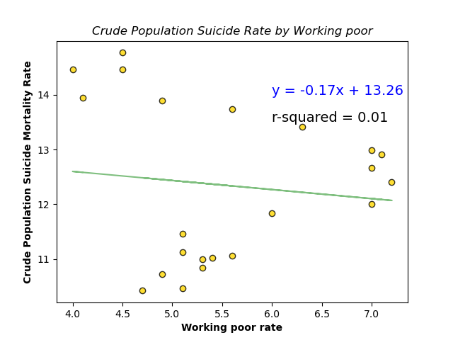

# Team Monty py-thon 👑

  

## **Title:**  Analyzing Suicide Rates in the United States by Census Regions (1999-2020)

## **Team members:** Eric Matthews, Sean Seaforth, and Woyni Teklay

## Background 
- Suicide is defined as death caused by self-directed injurious behavior with intent to die as a result of the behavior.
- A suicide attempt is a non-fatal, self-directed, potentially injurious behavior with intent to die as a result of the behavior. A suicide attempt might not result in injury.
- Suicidal ideation refers to thinking about, considering, or planning suicide.
- According to the Centers for Disease Control and Prevention (CDC) WISQARS Leading Causes of Death Reports, in 2020:
- Suicide was the twelfth leading cause of death overall in the United States, claiming the lives of over 45,900 people.
- Suicide was the second leading cause of death among individuals between the ages of 10-14 and 25-34 , the third leading cause of death among individuals between the ages of 15-24, and the fourth leading cause of death among individuals between the ages of 35 and 44.
- There were nearly two times as many suicides (45,979) in the United States as there were homicides (24,576).1
- Suicide is rarely caused by a single circumstance or event. Thus, understanding individual, relationships, community, and societal level factors are necessary to identify protective and risk factors.2

## Purpose 
- Research has shown significant variation in suicide risk among different races, genders, and geographical locations in the US, defined by Census Region. 3 The outcome of the analysis will help guide targeted interventions when drafting important legislative policies or plans for programs that aim to reduce suicide mortality by identifying the association of suicide rates by gender, race, and geographical location. 

## Methodology

**Step 1**. Gathered relevant data from reliable sources.
Sources: 	CDC Wonder & U.S. Bureau of labor statistics 5

**Step 2**. Cleaned and arranged data by gender, race, and census region using Jupyter Notebook. 

**Step 3**. Created visuals that depict trends

**Step 4**. Applied statistical testing

**Step 5**. Conclusion, Interpretation, Future Implications, and limitations

The Census Regions are defined as follows.

**Census Region 1 - Northeast** 
This includes the states Connecticut, Maine, Massachusetts, New Hampshire, New Jersey, New York, Pennsylvania, Rhode Island and Vermont.

**Census Region 2 - Midwest** 
This includes the states Illinois, Indiana, Iowa, Kansas, Michigan, Minnesota, Missouri, Nebraska, North Dakota, South Dakota, Ohio and Wisconsin.

**Census Region 3 - South** 
This includes the states Alabama, Arkansas, Delaware, District of Columbia, Florida, Georgia, Kentucky, Louisiana, Maryland, Mississippi, North Carolina, South Carolina, Oklahoma, Tennessee, Texas, Virginia, and West Virginia.

**Census Region 4 - West** 
This includes the states Alaska, Arizona, California, Colorado, Hawaii, Idaho, Montana, Nevada, New Mexico, Oregon, Utah, Washington, and Wyoming.

## Analysis 

**Figure 1**. Suicides per 100,000 people by 5-year increments

- Crude suicide rates have steadily risen from 1999 until 2017, when there appears to be a dip in suicide rates.

- Suicide rates have been on the rise since the SARS-COV-2 outbreak in 2020. 6

 
**Figure 2**. Annual Suicide Rate of US Population in Males by 5-year increments

 
**Figure 3**. Annual Suicide Rate of US Population in Females by 5-year increments

**Figure 4**. Annual suicide rate of US population in Asians by 5-year increments

**Figure 5**. Annual Suicide Rate of US Population in Whites by 5-year increments

**Figure 6**. Annual Suicide Rate of US Population in Native Americans by 5-year increments

**Figure 7**. Annual Suicide Rate of US Population in Blacks by 5-year increments

## Statistical Outputs

A scatterplot followed by a linear regression can be used to determine whether there is an association between two continuous variables. For the analysis depicted below, the output is crude population suicide mortality rate, and the independent variable is working poor rate. 

**Figure 8**. Least Squares Regression line of crude working poor rate and crude population suicide mortality rate from 1999-2020 

**Figure 9**. Scatter plot of crude working poor rate and crude population suicide mortality rate from 1999-2020  

The linear correlation coefficient (_r_) is always between -1 and +1 and if r is close to 0, then there is no significant linear correlation between x and y. _r_ measures the strength of a linear association. Based on the definition, there does not appear to be a strong linear correlation between crude suicide mortality rate and working poor rate. 

### Two-sample _t_-test: Method used to test whether the population means of two groups are equal or not. 

In order to apply the two-sample _t_-test there are a few asumptions that have to be met.
1. The two samples are independent.
2. The two samples are simple random samples.
3. Both samples are large and from normally distributed populations. 
4. Unknown population variance (assumed unequal)

**Result**. With a p-value of 2.51 x 10-66 << 0.05, there is sufficient evident to support the claim that the mean crude suicide mortality rate in males is
different or not equal to crude suicide mortality rate in females. 

## Conclusion 
- The highest suicide rates, irrespective of gender and race, prevail in Western and Southern Census regions. 
- The crude suicide rate in the South and West regions per 100,000 people in males [1999:2020, 18:24] is higher than the national crude suicide rate per 100,000 people in females within the same regions [1999:2020, 10:14].
- Crude suicide rates in the South and West regions per 100,000 people amongst Native Americans are higher [1999:2020, 12.5:22.5] than other races.
- Crude suicide rates in Whites[1999:2020, 12:18]
- Crude suicide rates in Blacks [1999:2020, 6:8]
- Crude suicide rates in Asians [1999:2020, 8:6]	
- There does not appear to be a strong linear correlation between crude suicide mortality rate and working poor rate. 
- There is sufficient evident to support the claim that the mean crude suicide mortality rate in males is different or not equal to crude suicide mortality rate in females

## Future Implications and Limitation

- Population data is not standardized 
- Population data is not adjusted by age
- Meditating factors have to be considered and controlled for using statistical applications
- The rate of movement between states can skew the output
- Testing for internal and external validity is essential for accuracy. 

## References 

1. Suicide defintion. https://www.nimh.nih.gov/health/statistics/suicide. Accessed on April 8, 2023. 
2. Suicide factors. https://www.cdc.gov/suicide/factors/index.html. Accessed on April 8, 2023.
3. The effects of race/ethnicity, income, and family structure on adolescent risk behaviors. https://www.ncbi.nlm.nih.gov/pmc/articles/PMC1446419/. Accessed on April 8, 2023. 
4.  Census Regions and Divisions of the United States. https://www2.census.gov/geo/pdfs/maps-data/maps/reference/us_regdiv.pdf. Accessed on April 8, 2023. 
5. CDC WONDER. https://wonder.cdc.gov/WelcomeT.html. Accessed on April 8, 2023. 
6. Association between COVID-19 pandemic and the suicide rate in Nepal. https://journals.plos.org/plosone/article?id=10.1371/journal.pone.0262958#:~:text=Over%20the%20entire%20pandemic%20period,0.45)%20suicide%20per%20100%2C000%20population. Accessed on April 8, 2023.
7. BLS Reports. https://www.bls.gov/opub/reports/archive.htm. Accessed on April 6, 2023. 
